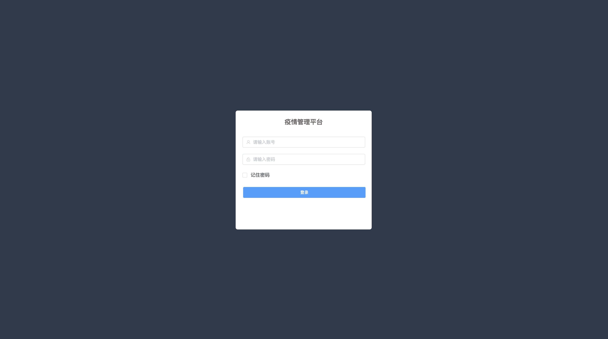
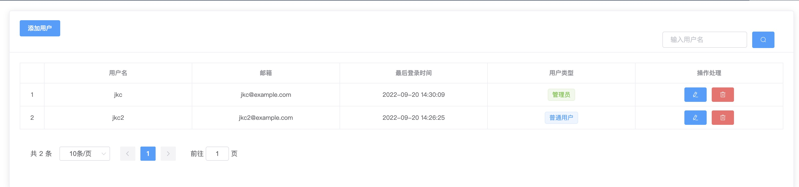
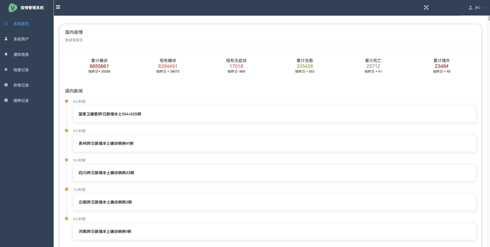
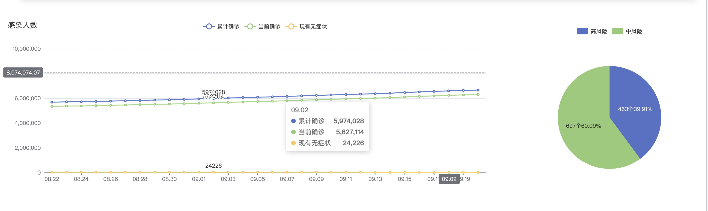
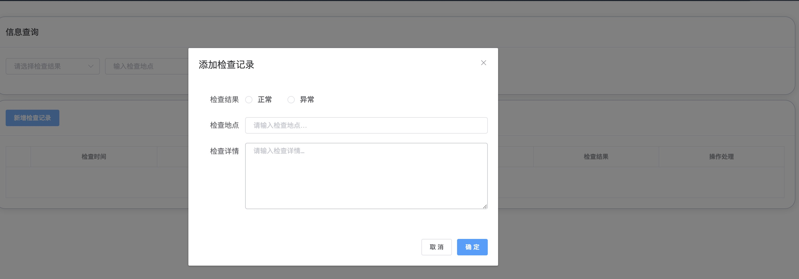

# epidemic
基于Django、Django Rest framework、Vue的前后端分离的社区疫情管理系统

# 系统功能
- 用户管理（只有管理员有权限）
  - 用户注册
  - 用户登录
  - 修改用户信息
  - 删除用户
  - 修改密码
  - 权限管理

- 首页数据展示
  - 国内疫情数据展示
  - 国内疫情新闻
  - 近30日的感染人数（柱状图）
  - 中高风险地区（饼图）

- 通知信息（只有管理员有权限）
  - 新增通知
  - 查看筛选通知
  - 修改通知
  - 删除通知

- 检查记录
  - 新增检查记录
  - 查看筛选检查记录
  - 修改检查记录
  - 删除检查记录

- 异常记录
  - 新增异常记录
  - 查看筛选异常记录
  - 修改异常记录
  - 删除异常记录
  
- 接种记录
  - 新增接种记录
  - 查看筛选接种记录
  - 修改接种记录
  - 删除接种记录


# 系统界面
- 登录页

- 用户管理

- 疫情数据

- echarts表格

- 检查记录


# 技术分析
选用Django就是为了快速开发，省事方便。

## 接口文档
采用drf-spectacular内置的swagger api

## 用户模块
模型：采用Django原生的AbstractUser模型，添加了level和avatar2个字段

认证：采用第三方库simplejwt生成token，序列化用的djoser中的序列化

权限：采用Django原生的IsAuthenticated

筛选：采用第三方库django-filter

## 爬虫
（爬取国内疫情数据，都是公开免费）

获取国内疫情新闻：从天行数据API接口获取

获取低中高风险地区：从别人那提供的接口，不知何时会失效，不怕麻烦也可以从聚合数据那获取（ps:由于大量for循环整合数结构，整体请求时间在2s左右，前端渲染很慢，后续优化）

获取近30天内的疫情数据：从腾讯免费疫情接口获取

## 检查模块
检查记录的增删改查

## 通知模块
通知记录的增删改查

## 异常模块
异常记录的增删改查

## 接种模块
接种模块的增删改查

# Django原生部署

## 1.安装环境poetry


## 2.拉取代码
```
cd ~ # 环境当前用户home目录
git clone https://github.com/s649821022/epidemic.git
```

## 3.在poetry环境中安装依赖
```
poetry install
```
- 安装mysqlclient报错,可以输入下面2条命令
```
PATH="$PATH":/usr/local/mysql/bin/
mysql_config
```

## 4.创建对应的数据库
```
vim epidemic/config/settings/local.py #查看本地配置文件
# 然后找到数据库配置
DATABASES = {
    "default": {
        "ENGINE": "django.db.backends.mysql",
        "NAME": "epidemic",
        "USER": "root",
        "PASSWORD": "123456",
        "HOST": "127.0.0.1",
        "PORT": 3306,
    }
}
```
创建的数据库信息和配置文件需要保持一样.

## 5.执行Django数据库迁移脚本
```
cd epidemic # 进入epidemic根目录
python manage.py makemigrations  # 生成数据库迁移脚本
python manage.py migrate  # 执行数据库迁移脚本
```

## 6.启动Django服务
```
默认就是本机的8000端口启动,只能本机访问
python manage.py runserver 
```

